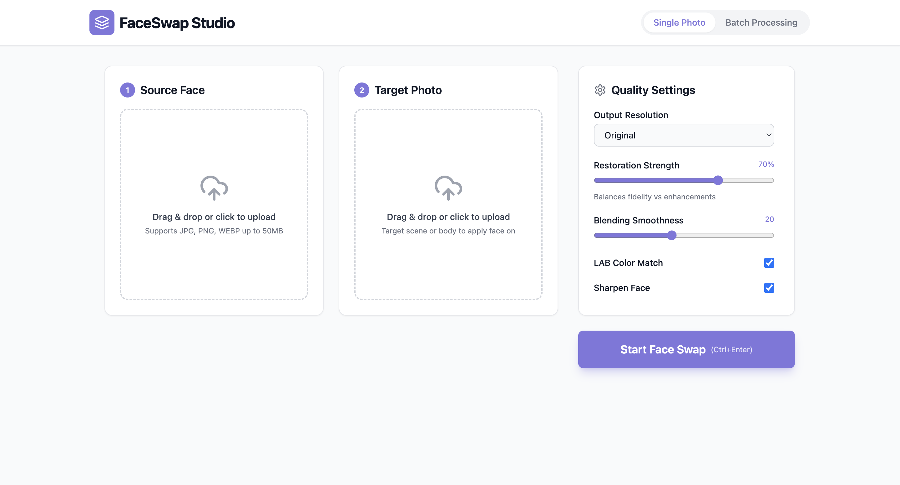

# FaceSwap Studio



A production-grade, photorealistic Face Swap Studio web application designed for professional photography studios. 
Powered by InsightFace (`inswapper_128.onnx`), GFPGAN/CodeFormer, and FastAPI.

## Features
- **High-Precision Face Swap**: Uses the industry-leading InsightFace model for robust face detection and sub-pixel alignment.
- **Face Restoration**: Integrates CodeFormer/GFPGAN to bring back fine details (skin texture, pores, eyelashes).
- **Seamless Blending & Color Matching**: Applies LAB color space transfer and Poisson seamless blending for natural, invisible edges.
- **Batch Processing**: Swap faces across multiple images at once.
- **Original Resolution**: Preserves original image quality with no downscaling.
- **GPU Accelerated**: Full support for NVIDIA CUDA (on Linux/Windows) and Apple Silicon (on Mac).

## Quick Installation (Copy & Paste)

Follow these steps in order to set up the project from scratch.

### 1. Backend Setup & Libraries
Open your terminal and run:

```bash
# Navigate to backend and create environment
cd backend
python -m venv venv
source venv/bin/activate  # On Windows: venv\Scripts\activate

# Install all required libraries
pip install fastapi uvicorn python-multipart websockets insightface onnxruntime opencv-python-headless numpy Pillow gfpgan tqdm requests scipy
```

### 2. Download AI Models
The application needs specific models to work. Run these commands to create the folder and download the main swapper model:

```bash
# Create models directory
mkdir -p models

# Download inswapper_128.onnx (approx 550MB)
# Note: If curl is not installed, download manually from InsightFace and place in backend/models/
curl -L -o models/inswapper_128.onnx https://github.com/facefusion/facefusion-assets/releases/download/models/inswapper_128.onnx
```

### 3. Frontend Setup
Open a **new terminal tab**, navigate to the project root, and run:

```bash
cd frontend
npm install
npm run dev
```

---

## Running the Application

### Step 1: Start Backend
```bash
cd backend
source venv/bin/activate
uvicorn main:app --reload --host 0.0.0.0 --port 8000
```

### Step 2: Start Frontend
```bash
cd frontend
npm run dev
```

The application will be available at:
- **Frontend**: [http://localhost:5173](http://localhost:5173)
- **Backend API**: [http://localhost:8000](http://localhost:8000)

---

## Model Details
If you prefer manual downloads, place these in `backend/models/`:
- `inswapper_128.onnx`: The main face swapping engine.
- `GFPGANv1.4.pth`: Used for face restoration (automatically downloaded on first run).
- `buffalo_l`: Detection model (automatically downloaded by InsightFace).

## Troubleshooting
- **Mac (Apple Silicon)**: Ensure you use `onnxruntime`. The project is optimized for Mac's CoreML.
- **Windows/Linux GPU**: If you have an NVIDIA GPU, you can run `pip install onnxruntime-gpu` for a massive speed boost.
- **Out of Memory**: If processing high-res images crashes, try closing other apps to free up VRAM/RAM.
